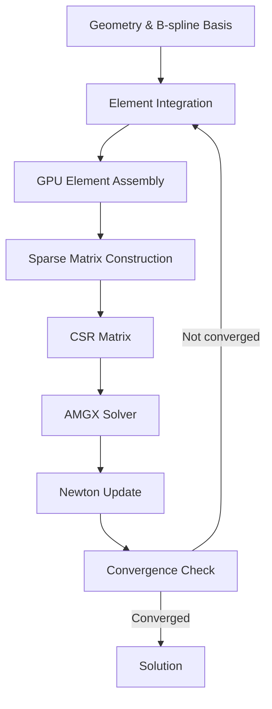

# SIGA


---

## Overview

**SIGA (Scalable Isogeometric Analysis)** is a GPU-accelerated framework for solving large-scale nonlinear mechanics problems using **Isogeometric Analysis (IGA)**.

The project focuses on **high-order spline discretizations**, **nonlinear elasticity**, and **large-scale sparse systems**, with most heavy computations executed on NVIDIA GPUs using CUDA.

SIGA is designed primarily for **research in computational mechanics** and **high-performance finite element methods**.

---

## Key Features

- High-order **B-spline / NURBS IGA**
- **GPU accelerated assembly and linear algebra**
- Efficient **sparse matrix assembly**
- Large-scale systems (>500k DOFs)
- Newton iteration framework for nonlinear problems
- CUDA-based parallel kernels
- Integration with **AMGX GPU solvers**
- Designed for **high-performance computing**

---

## Architecture



---

## Repository Structure

```text
SIGA
│
├── src                  All source files
├── examples             Example simulations
├── external             Dependencies
├── AMGX_config          AMGX solver configurations
└── CMakeLists.txt
```

---

## Dependencies

SIGA depends on a modern C++/CUDA toolchain together with a small set of scientific computing libraries.  
The core requirements are listed below, followed by optional components that can be enabled at configure time.

### Core Dependencies

- **C++17** compatible compiler
- **CMake**
- **CUDA Toolkit**
- **Eigen**

### Optional Components

| Library | Description | CMake Option |
|---------|-------------|--------------|
| **NVIDIA AMGX** | GPU-accelerated iterative solvers and algebraic multigrid preconditioning for large sparse linear systems. | `ENABLE_AMGX` |
| **Intel MKL** | High-performance CPU linear algebra backend for Eigen-based operations. | `EIGEN_USE_MKL_ALL` |
| **Spectra** | Iterative eigensolver library for computing a small number of eigenvalues and eigenvectors of large sparse systems. | `ENABLE_SPECTRA` |

### Notes

- Enable **AMGX** when GPU-based sparse linear solves and AMG preconditioning are needed.
- Enable **MKL** when faster CPU-side dense or sparse linear algebra is desired through Eigen.
- Enable **Spectra** when you want use Spectra to compute eigenvalues. I found it is slower than cusolver's dense eigenvalue solver `cusolverDnXsyevd`.
- **AMGX is not supported in Debug builds.** If you need to run SIGA in Debug mode, configure the project with `ENABLE_AMGX=OFF`.
- When **AMGX is disabled**, SIGA falls back to:
  - **`Eigen::SimplicialLDLT`** for linear solves on the CPU
  - **`cusolverDnXsyevd`** for eigenvalue computations on the GPU
- These fallback solvers remain efficient for small to medium-sized problems, and are convenient for development, verification, and debugging workflows.

---

## Build

SIGA uses an out-of-source CMake build.

### 1. Clone the Repository

SIGA includes several external libraries as Git submodules.  
To clone the repository together with all required submodules, run:

```bash
git clone --recurse-submodules https://github.com/yourusername/SIGA.git
cd SIGA
```

If you already cloned the repository without submodules, run:

```bash
git submodule update --init --recursive
```

### 2. Create a build directory

```bash
mkdir build
cd build
```

### 3. Configure

A minimal Release configuration can be generated with:

```bash
cmake .. -DCMAKE_BUILD_TYPE=Release
```

To enable optional components, pass the corresponding CMake options during configuration. For example:

```bash
cmake .. -DCMAKE_BUILD_TYPE=Release -DENABLE_AMGX=ON -DENABLE_SPECTRA=ON
```

If Intel MKL is available and Eigen is configured to use it, you may configure with:

```bash
cmake .. -DCMAKE_BUILD_TYPE=Release -DEIGEN_USE_MKL_ALL=ON
```

For debugging, disable AMGX explicitly:

```bash
cmake .. -DCMAKE_BUILD_TYPE=Debug -DENABLE_AMGX=OFF
```

### 4. Build

```bash
cmake --build . --config Release
```

For a Debug build:

```bash
cmake --build . --config Debug
```

### Remarks

- The exact availability of optional components depends on whether the corresponding third-party libraries are installed and discoverable by CMake.
- Since **AMGX cannot be built in Debug mode**, Debug configurations should be used with `ENABLE_AMGX=OFF`.
- In Debug mode, SIGA uses **`Eigen::SimplicialLDLT`** for linear solves and **`cusolverDnXsyevd`** for eigenvalue computations.
- These alternatives are still reasonably fast when the system size is not too large.
- On Windows, additional runtime configuration may be required for CUDA, MKL, or AMGX shared libraries.
- For best performance, use a Release build rather than Debug.

---

## Examples

The `examples` folder currently contains two basic benchmark-style examples for nonlinear displacement-controlled simulations on multi-patch spline domains.

### Available Examples

| Example | Description |
|---------|-------------|
| **`test.cu`** | 2D two-patch example. Builds a two-patch planar geometry, performs degree elevation and uniform refinement, applies displacement boundary conditions, solves the nonlinear problem, and writes ParaView output for each load step. |
| **`test_3D.cu`** | 3D two-patch example. Builds a two-patch volumetric geometry, applies displacement boundary conditions in 3D, solves the nonlinear system, and writes ParaView output for each load step. |

### Running an Example

After building, run the corresponding executable from the build output directory.  
The exact executable name depends on your CMake target names.

Typical usage is:

```bash
./test
./test_3D
```

### Output

Both examples generate output directories automatically and write visualization files that can be opened in ParaView.

- The 2D example writes results under `./TwoPatchesTest/`
- The 3D example writes results under `./TwoPatchesTest_3D/`

Each example outputs:
- the initial geometry
- deformed configurations for each load step
- a ParaView collection file for time-series visualization

### Post-processing Note

`GPUPostProcessor` provides an option to export the computational mesh during output generation.

For models with a large number of elements, disabling mesh output is often recommended because it can:

- reduce memory usage
- lower post-processing cost
- improve visualization clarity by preventing the mesh lines from obscuring the solid body

In particular, for very fine discretizations, mesh rendering may visually cover the entire model.

### AMGX Runtime Requirement

When running an executable that uses the **AMGX** solver, the following files must be placed in the **same directory as the executable**:

- **`amgxsh.dll`**
- **`SOLVER_CONFIG_INUSE.json`**

Without these files, the executable will not run correctly with AMGX enabled.

---

## Performance

Representative performance measurements on an **NVIDIA RTX 3080 Ti** are shown below for a **2D cubic B-spline** discretization.

### 2D Cubic B-spline Benchmark

| DOFs | Assembly Time | Linear Solve Time |
|------|---------------|-------------------|
| 50k  | ~0.5 s        | ~1 s              |
| 500k | ~2 s          | ~4–6 s            |

### Benchmark Notes

- The reported timings correspond to a typical nonlinear analysis workflow and should be interpreted as representative rather than absolute performance figures.
- Assembly time denotes the cost of residual evaluation and tangent stiffness matrix construction for one Newton iteration.
- Linear solve time denotes the cost of solving the corresponding linearized system within one Newton step.
- Actual performance depends on several factors, including spline order, quadrature cost, constitutive model complexity, sparsity pattern, solver settings, and GPU hardware.
- For large-scale problems, solver performance is often the dominant cost, while for smaller problems the assembly and data movement overhead may be comparatively more visible.

---

## Future Work

Planned directions for future development include:

- **Multiphysics coupling**, including extensions to coupled field problems arising in advanced computational mechanics
- **AMGX-based eigenvalue solvers**, with an emphasis on large-scale instability and modal analysis
- **Multi-GPU support**, aimed at improving scalability for very large simulations
